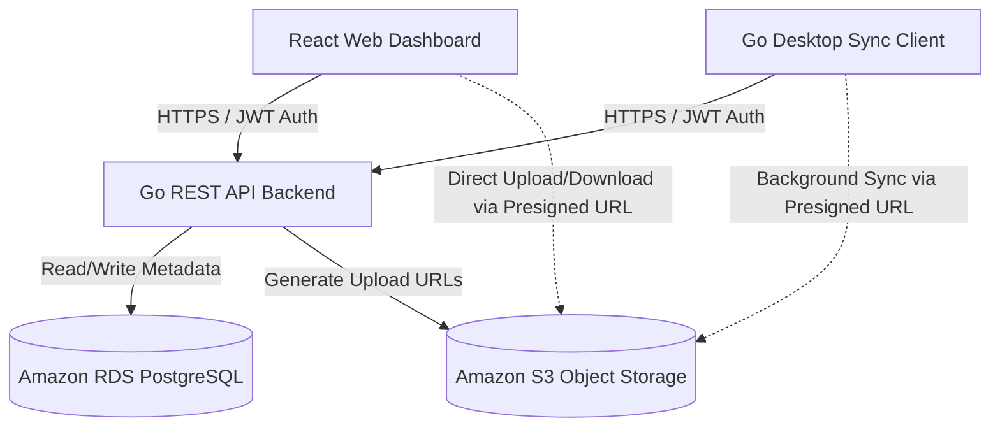

# Product Requirements Document (PRD) - GoBox

This document outlines the Minimum Viable Product (MVP) business and functional requirements for **GoBox**, a self-hosted cloud storage and directory synchronization platform. The goal of this project is to build a lightweight, highly performant Dropbox clone while mastering the Go programming language, React frontend development, and AWS cloud architecture.

---

## 1. System Architecture Overview

The system consists of three primary components interacting with AWS Cloud Infrastructure:
1. **Go REST API (Backend):** Manages user sessions, authenticates requests, stores file metadata, and generates secure AWS S3 Presigned URLs.
2. **React Web Dashboard (Frontend):** A web-based file explorer interface allowing manual management via browsers.
3. **Go Sync Client (Desktop):** A background application that watches a localized filesystem directory and bi-directionally synchronizes changes with the cloud.

## 2. Core Functional Requirements

### 2.1. Authentication & Security (Backend)
* **Secure User Management:** Users must be able to register an account, log in securely, and log out.
* **Token-Based Authorization:** All communication between the client applications (Web/Desktop) and the backend must be authorized using JSON Web Tokens (JWT) sent via HTTP headers.
* **Strict Multi-Tenancy:** Storage paths must be strictly isolated. A user must never be able to view, download, or modify files belonging to another account.
* **Storage Quotas:** The system must enforce a storage threshold per user (e.g., 2 GB maximum capacity) and reject metadata creation if the quota is exceeded.

### 2.2. Web Dashboard Requirements (React Frontend)
* **File Explorer UI:** An interactive interface displaying a nested directory tree of files and folders stored in the cloud.
* **Manual Upload & Download:**
  * Users must be able to drag-and-drop or select files from their computer to upload them.
  * Files must be uploaded **directly to AWS S3** using secure Presigned URLs provided by the Go backend to optimize bandwidth.
  * Users must be able to securely download any cloud file.
* **Directory Management:** Users must be able to create new folders and delete existing files or folders directly from the browser view.

### 2.3. Desktop Sync Client Requirements (Go Desktop App)
* **Local Sandbox Directory:** Upon initial configuration, the application must designate a specific local operating system folder (e.g., `~/GoDropbox`) as the single source of truth for synchronization.
* **Automated Change Detection (Local $\rightarrow$ Cloud):**
  * The application must run quietly in the OS background.
  * It must watch the sandbox folder using filesystem event listeners (`fsnotify`).
  * When a file is created, modified, or deleted locally, the client must compute the file's SHA-256 hash, compare it against a local SQLite cache, and automatically update the cloud state via the backend API.
* **Automated Pull Synchronization (Cloud $\rightarrow$ Local):**
  * The desktop application must periodically poll the backend or maintain a persistent connection to detect changes made via the Web Dashboard.
  * Any new files uploaded through the web must automatically download to the local sandbox folder.
* **Conflict Resolution:** If a file is modified locally and in the cloud simultaneously, the desktop application must rename the local copy to a conflict format (e.g., `filename_conflict_copy.txt`) to prevent accidental data loss.

---

## 3. Non-Functional & Cloud Requirements

* **Performance:** The Go backend and desktop client must remain lightweight, optimizing memory footprint (under 50MB RAM usage during idle cycles).
* **Cloud Cost Efficiency:** The entire AWS footprint must run completely inside the **AWS Free Tier** limits, utilizing `t3.micro` or `t4g.micro` instances for compute and database layers.
* **Data Integrity:** Files must be stored securely using standard AWS S3 bucket policies with public block access fully enabled.
